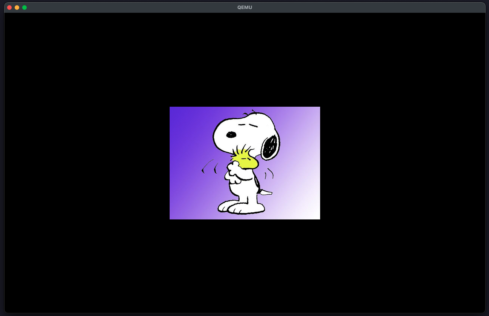

## 🚀 Features

* [x] bootloader + bootinfo parsing (using the latest bootloader `v0.11.X` crate.)
* [x] serial logging
* [x] writing/rendering using framebuffer
* [x] interrupt handling (IDT, GDT)
* [x] APIC (Advanced Programmable Interrupt Controller)
* [x] timer (using `apic`)
* [x] acpi parsing and address translation
* [x] handle double faults, page faults, exception breakpoints
* [x] keyboard input
* [x] paging, heap allocation, memory management
* [x] async tasking
* [x] co-operative multitasking
* [x] elementary graphics (tga images, bouncing ball, gifs)

## References

* [Bare Bones - OSDev Wiki](https://wiki.osdev.org/Bare_Bones)
* [Writing an OS in Rust](https://os.phil-opp.com/)
* [Writing an operating system](https://youtube.com/playlist?list=PL980gcR1LE3LBuWuSv2CL28HsfnpC4Qf7&si=ychOZDandztTEfA4)
